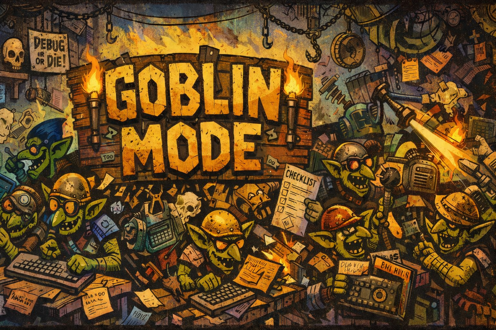

# ~~Claude Code~~ <ins>`goblin mode`</ins> <!-- rumdl-disable-line MD033 -->

> [!CAUTION]
> 50% useful tool/teaching resource for agentic coding, 50% externalised temper tantrum.

**Goblin Mode** is a permanently-in-flux configuration system (skills, agents, hooks) built by one developer to solve problems they actually had. Every skill traces back to a specific friction point. Hooks enforce habits that were being skipped.

> [!NOTE]
> This setup is specific to one developer's workflow (and brain). If you're building your own, the **process** is what's transferable; the specifics should be yours. Start with [Building Your Own](docs/guides/building-your-own.md).

---

## What's In Here

| Component     | Count | What it does |
|----------------|-------|--------------|
| **Skills (command)** | 27 | Slash commands you invoke (e.g. `/git-commit-one`) |
| **Skills (role)**    | 15 | Ambient knowledge that loads automatically when relevant |
| **Skills (model-invocable command)** | 3 | Command skills the model can also self-invoke |
| **Agents**     | 10 | Autonomous sub-processes for multi-step work |
| **Hooks**      | 3 global + 2 project-level | Scripts triggered by git and session events |

These counts are generated, not hand-counted — see [Keeping this wiki honest](docs/README.md#keeping-this-wiki-honest).

---

## Quick Start

1. **Read [CLAUDE.md](CLAUDE.md)** — the behaviour file, loaded every session: tone, code conventions, git workflow.
2. **Browse [docs/README.md](docs/README.md)** — the documentation wiki: architecture, and a reference page per subsystem.
3. **Browse [skills/README.md](skills/README.md)** — the full generated index of every skill.

## Directory Guide

| Directory | What's there |
|---|---|
| [`CLAUDE.md`](CLAUDE.md) | The behaviour file — technical profile, communication rules, code conventions, git workflow, security defaults. Loaded every session. |
| [`skills/`](skills/) | Command skills (invoked with `/name`) and role skills (load automatically). See [Skills reference](docs/reference/skills.md). |
| [`agents/`](agents/) | Autonomous multi-step workflows Claude delegates to. See [Agents reference](docs/reference/agents.md). |
| [`hooks/`](hooks/) | Scripts on git/session events. See [Hooks reference](docs/reference/hooks.md). |
| [`library/`](library/) | Shared references, templates, scripts, and config examples used by skills. See [Library reference](docs/reference/library.md). |
| [`output-styles/`](output-styles/) | Tone and personality definitions — `british-dev-goblin.md` is the active one. |
| [`docs/`](docs/) | This wiki — architecture, per-subsystem reference, guides, and design history. |

For the full picture — how the layers fit together, what each costs to load, and the deterministic-half pattern behind several skills — see **[Architecture](docs/architecture.md)**.

---

## Building Your Own

The full guide is at [docs/guides/building-your-own.md](docs/guides/building-your-own.md). The short version: respect the context window, start from friction rather than speculation, encode decisions rather than preferences, and let it grow one problem at a time.

---

## Documentation Index

| Page | Description |
|---|---|
| [Documentation wiki](docs/README.md) | Full index — start here for anything beyond this README |
| [Architecture](docs/architecture.md) | How the layers fit, context-window cost, the deterministic-half pattern |
| [Skills](docs/reference/skills.md) · [Agents](docs/reference/agents.md) · [Hooks](docs/reference/hooks.md) · [Library](docs/reference/library.md) · [Configuration](docs/reference/configuration.md) | Per-subsystem reference |
| [Building Your Own](docs/guides/building-your-own.md) | Transferable process for building your own setup |
| [Glossary](docs/glossary.md) | Vocabulary specific to this config |
