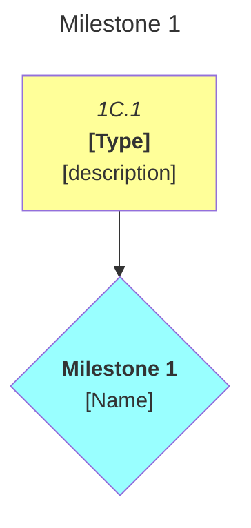
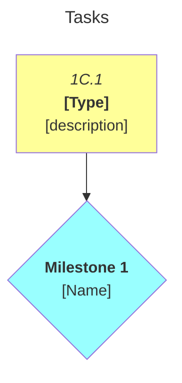

# [Project Name]: [Roadmap Name]

> For a worked example of a complete roadmap in this format, see
> [`library/docs/examples/mvp.md`](../examples/mvp.md).

|          | Status | Next Up | Blocked |
| -------- | ------ | ------- | ------- |
| **[Cat]** | [current state] | [next task ID] | [blocked task ID] |

---

## Contents

- [Milestones](#milestones)
  - [Milestone 1: Name](#m1)
- [Progress Map](#map)
- [Links](#links)
- [Beyond MVP](#post-mvp)

---

<a name="milestones"><h2>Milestones</h2></a>

Task ID format: `{Milestone}{Category}.{Seq}` — e.g. `1C.1`, `2TI.7`, `3DC.2`

- Sub-tasks: append alpha suffix — `2TI.3a`, `2TI.3b`
- Additions: append next number in category. Never renumber existing IDs.

<a name="m1"><h3>Milestone 1: [Name]</h3></a>

> [!IMPORTANT]
> **Goal:** [What this milestone delivers]

> [!NOTE]
> **Key**
> - [Abbrev] ([category name])

<a name="m1-doing"><h4>In Progress (Milestone 1)</h4></a>

- [ ] 1C.1. [Task description]

<a name="m1-todo"><h4>To Do (Milestone 1)</h4></a>

<a name="m1-blocked"><h4>Blocked (Milestone 1)</h4></a>

- [ ] 1C.2. [Task description] — **depends on 1C.1**

<a name="m1-done"><h4>Completed (Milestone 1)</h4></a>

---

<a name="post-mvp"><h2>Beyond [Roadmap Name]: Future Features</h2></a>

<h3>[Future feature name]</h3>

> [!NOTE]
> - [Description]

---

<a name="links"><h2>Links</h2></a>

<h3>Work Records</h3>

See [`docs/work-records/`](../work-records/) for detailed development history.

---

<a name="map"><h2>Progress Map</h2></a>

