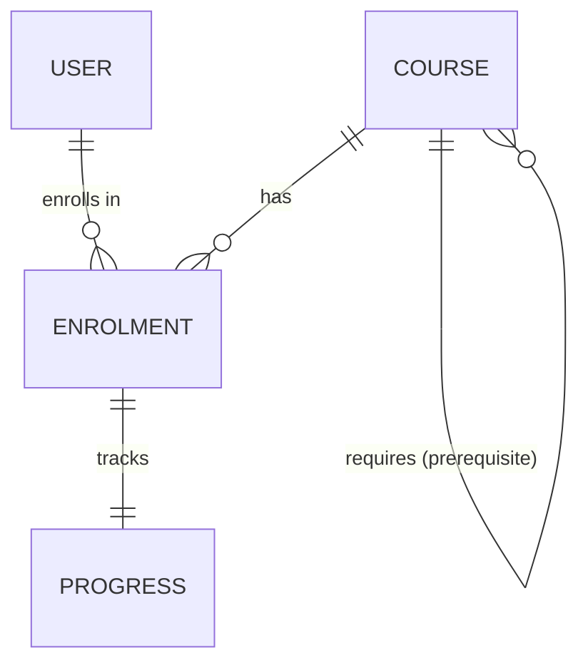
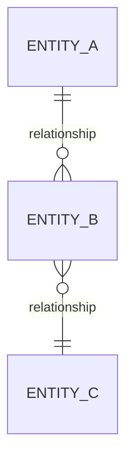

# Domain Modeller

Model-first design skill. Maps entities, relationships, and boundaries before code. Prioritises understanding the domain over jumping to implementation. Outputs conceptual models as Mermaid diagrams or Cypher-compatible graph structures.

---

## When This Skill Applies

Use this skill when:
- Designing a new feature, module, or system
- The conversation shifts from "what should we build" to "how should we build it"
- Entities and their relationships are unclear or undocumented
- Multiple data stores are involved (polyglot persistence decisions)
- A feature touches multiple parts of the system
- The user says "I'm not sure how this fits together"
- Before writing any significant new code

---

## Core Principle

**Understand the domain before solving it.**

Sophistication is not clever code — it's depth of understanding. A well-modelled domain makes implementation obvious. A poorly modelled domain makes every line of code a fight.

The sequence is always: **Model → Design → Build**

---

## The Modelling Process

### Step 1: Identify Entities

What are the nouns? What things exist in this domain?

**Questions to ask**:
- What are the core objects/concepts?
- Which of these are primary (exist independently) vs secondary (exist in relation to something else)?
- What's the lifecycle of each entity?
- Are there implicit entities hiding behind properties?

```
Example: "Users can enrol on courses and track progress"

Entities: User, Course, Enrolment, Progress
Hidden entity: Enrolment is not just a boolean — it has state (enrolled, active, completed, dropped)
```

### Step 2: Map Relationships

What connects to what? How? With what cardinality?

**Questions to ask**:
- What's the nature of each connection? (has, belongs to, creates, requires, follows)
- What's the cardinality? (one-to-one, one-to-many, many-to-many)
- Do relationships carry data? (e.g., "enrolled since", "role in team")
- Are there transitive relationships? (A→B→C implies something about A→C?)
- What's the directionality?



### Step 3: Define Boundaries

Where does one concern end and another begin?

**Questions to ask**:
- Which entities are tightly coupled? (change together)
- Which entities are loosely coupled? (change independently)
- Where are the natural service/module boundaries?
- Which data needs strong consistency? Which can be eventually consistent?

### Step 4: Choose Data Homes

Given the model, where does each entity live?

**Decision framework** (from data-ontologist skill):
- **Relationships are primary concern** → Neo4j (graph)
- **Structured, transactional entities** → PostgreSQL (relational)
- **Flexible, nested documents** → MongoDB (document)
- **Simple key-value** → Consider if a full database is even needed

### Step 5: Output the Model

Produce a visual representation. Prefer:
1. **Mermaid ER diagram** — for entity-relationship overview
2. **Cypher patterns** — for graph-oriented domains
3. **Plain text table** — when the model is simple enough

---

## Output Formats

### Mermaid ER Diagram


### Cypher Pattern Map
```cypher
(:User)-[:ENROLLED_IN {since: date}]->(:Course)
(:Course)-[:REQUIRES]->(:Course)
(:User)-[:COMPLETED {score: float}]->(:Module)
```

### Entity Summary Table

| Entity | Primary Store | Key Properties | Relationships |
|--------|--------------|----------------|---------------|
| User | PostgreSQL | id, email, name | enrolls in Course, completes Module |
| Course | MongoDB | id, title, content | requires Course, has Module |

---

## Graph-First Thinking

When in doubt, start with the graph.

Most real-world domains are fundamentally about relationships. Tables and documents are storage optimisations — the graph is the truth. Start by drawing nodes and edges, then decide where to persist them.

**Process**:
1. Draw entities as nodes
2. Draw relationships as labelled, directed edges
3. Annotate edges with properties where relationships carry data
4. Look for patterns: chains, cycles, trees, hubs
5. *Then* decide which database handles which part

**Common graph patterns**:
- **Tree**: org charts, category hierarchies, file systems
- **DAG** (directed acyclic graph): prerequisites, build dependencies, workflows
- **Social graph**: follows, friendships, collaborations
- **Bipartite**: users↔products, students↔courses, employees↔skills

---

## Red Flags in Domain Models

Watch for these — they usually indicate the model needs more thought:

- **God entity**: One entity with 20+ properties → probably multiple entities merged
- **Implicit relationships**: Using foreign keys where the relationship itself has meaning → model the relationship explicitly
- **Missing lifecycle**: Entity has no clear states → you'll fight state management later
- **Circular ownership**: A owns B owns C owns A → clarify the real hierarchy
- **Premature normalisation**: Splitting things that always change together → keep them together
- **Premature denormalisation**: Duplicating data that changes independently → keep it normalised

---

## Integration Points

### With data-ontologist
Domain modeller identifies *what* exists and how it connects. Data-ontologist decides *where* it lives and how to query it.

### With implementation-planner
The domain model feeds directly into the implementation plan. Model first, plan second, build third.

### With ethics-reviewer
Certain domain entities (user data, tracking, notifications) trigger ethical review. If the model includes personal data or behavioural tracking, flag it.

### With scope-coach
A domain model often reveals more complexity than expected. Scope coach helps cut back to what's essential for the first iteration.

---

## Anti-Patterns

### Don't: Model the database schema first
```
✗ "We need a users table with these columns..."
✓ "Users have identities, belong to organisations, and enrol in courses..."
```

### Don't: Skip modelling for "simple" features
```
✗ "It's just a CRUD form, no need to model"
✓ Even simple features benefit from 2 minutes of entity mapping
```

### Don't: Model the entire universe
```
✗ Every possible future entity mapped in detail
✓ Core entities for the current scope, with notes on expansion points
```

---

## Success Criteria

Domain modelling is complete when:
- All core entities are identified and named
- Relationships are explicit, directed, and labelled
- Boundaries are clear (what changes together, what's independent)
- Data homes are justified (why PostgreSQL vs Neo4j vs MongoDB)
- The model is visual (Mermaid, Cypher, or diagram)
- Hidden complexity has been surfaced
- The team could implement from the model without further questions
